# Spatial Inpainting of Combine Harvester Yield Maps via Deep Learning

## 1. Problem Statement, Related Work and Proposed Approach

### 1.1 Problem Statement

Yield maps obtained from combine harvesters frequently contain missing data regions
within field boundaries. These gaps arise from various sources: GPS signal loss,
sensor malfunctions, overlapping passes, or edge effects near field boundaries.
The missing regions can represent 10–50% of the total field area, significantly
reducing the value of yield data for agronomic decision-making, management zone
delineation, and crop model calibration.

The goal of this work is to reconstruct missing yield values within field
contours by leveraging surrounding observed yield data and a set of spatial
predictors that capture terrain, soil, and vegetation characteristics.

This work frames yield map reconstruction as a **spatial inpainting task** in
computer vision, solved as a **pixel-level regression** using a convolutional
neural network. The model predicts continuous yield values (t/ha) for missing
pixels — analogous to image inpainting but applied to multi-channel geospatial
raster data rather than RGB images.

- **Input:** a yield raster with masked regions (holes) + spatial predictor rasters
- **Target:** the original yield values in the masked regions
- **Evaluation:** error metrics computed exclusively on the masked (hole) pixels

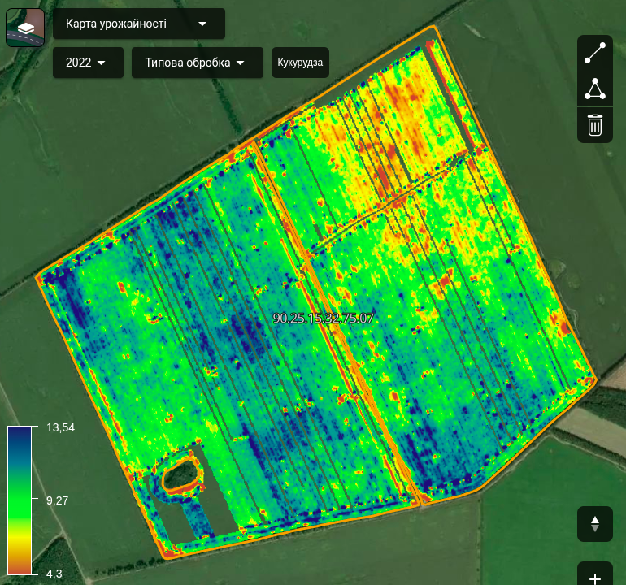

*Figure 1: Yield maps from combine harvesters showing real NaN gaps within field boundaries.*

---

### 1.2 Related Work

Yield map gap-filling has been approached through several methods in the
precision agriculture literature.

**Spatial interpolation methods** such as kriging and inverse distance weighting
(IDW) are the most widely used in practice. They rely solely on the spatial
autocorrelation of yield values and do not incorporate auxiliary environmental
information. While computationally simple, they tend to produce oversmoothed
estimates and fail when gaps are large relative to the spatial correlation range.

**Machine learning regression models** — including random forests, gradient
boosting, and support vector regression — have been applied to yield prediction
using environmental covariates such as soil properties, terrain indices, and
remote sensing data. However, these models typically operate at the field or
management-zone level rather than at the pixel level, and do not explicitly
model spatial context within the gap.

**Deep learning for spatial inpainting** has been extensively studied in computer
vision, where convolutional neural networks — particularly UNet-based architectures
with skip connections — have demonstrated strong performance for image inpainting
tasks. These models leverage local spatial context through receptive fields spanning
multiple scales. Recent work has applied similar architectures to geospatial raster
data including soil mapping, remote sensing gap-filling (e.g. cloud removal in
satellite imagery), and terrain reconstruction. The UNet architecture is
particularly well-suited for dense prediction tasks where the output has the same
spatial resolution as the input.

**Partial convolutions** (Liu et al., 2018) were specifically designed for image
inpainting, masking hole pixels during convolution to prevent information leakage.
**Contextual attention** mechanisms (Yu et al., 2018) allow the network to borrow
features from distant spatial locations, which is beneficial for reconstructing
large gaps.

To our knowledge, no published work has applied deep convolutional inpainting
specifically to combine harvester yield maps using multi-channel spatial predictor
stacks at sub-field resolution. This work addresses that gap.

---

### 1.3 Proposed Approach

The key distinction of this work from classical gap-filling methods is the
use of multi-channel spatial predictors as physical prior information for
reconstruction. Rather than relying solely on spatial autocorrelation of
yield values, the model leverages terrain, soil and vegetation data to
predict yield even in regions with no observed neighbours.

#### 1.3.1 Key Hypothesis

Crop yield at a given location is determined not only by the surrounding observed
yield values but also by the physical characteristics of that location. If these
characteristics are known at every pixel, they provide strong prior information
for reconstructing missing values — even in the absence of observed neighbours
inside a gap.

The following categories of spatial predictors are used:

- **Geomorphological and topographic maps** — derived from a Digital Elevation
  Model (DEM): elevation, slope, relative topographic position, terrain
  morphological classification (geomorphons), relief classification
- **Hydrological indices** — Height Above Nearest Drainage (HAND) and
  Topographic Wetness Index (TWI), capturing soil moisture distribution
  and drainage patterns
- **Soil properties** — composite soil index reflecting spatial distribution
  of texture and organic matter
- **Vegetation index** — NDVI (Normalized Difference Vegetation Index),
  a satellite-derived pre-season index reflecting crop establishment
  and soil fertility at the time of sowing

Together these layers encode the physical drivers of yield spatial variability
at pixel level. All predictors are combined with the masked yield raster and
a binary hole mask into a **39-channel input stack** per pixel.

Beyond the core deep learning model, the pipeline incorporates classical
computer vision methods: Canny edge detection on FFT high-frequency residuals
for combine harvester stripe angle detection, pixel-level raster preprocessing,
morphological operations, and sliding-window patch extraction with prediction
averaging.

#### 1.3.2 Models

Three UNet variants are trained and compared:

- **Baseline (ShallowUNet)** — 3 encoder levels, ~488K parameters, manually
  tuned hyperparameters
- **Deep (DeepUNet)** — 4 encoder levels, ~7.8M parameters, manually tuned
  hyperparameters
- **Deep + Optuna** — 4 encoder levels, hyperparameters optimized via Bayesian
  search (Optuna TPE sampler, 50 trials), ~1.9M parameters

All models are evaluated on held-out test fields using MAE, RMSE, Bias, MAPE
and R² computed exclusively on hole pixels in real units (t/ha).

---

## 2. Dataset

The dataset consists of **30 agricultural fields** located in Ukraine. All 30 fields are planted with **corn**. Each field is represented as a set of co-registered raster layers at consistent spatial resolution, clipped to the field boundary provided as a GeoPackage (`.gpkg`) polygon.

### 2.1 Data Sources

| Layer | Source | Native Resolution |
|---|---|---|
| Digital Elevation Model | Copernicus DEM GLO-30 | 30 m |
| Land cover (forest mask) | ESA WorldCover 2021 | 10 m |
| Optical imagery (NDVI, Soil) | Sentinel-2 L2A | 10 m |
| Yield maps | Combine harvester yield monitor | 10 m |
| Field boundaries | GeoPackage vector polygons | — |

All layers are resampled and reprojected to **5 m pixel resolution**
in UTM coordinate reference system (EPSG:32636) to match the yield
monitor spatial resolution.

---

### 2.2 Input Feature Channels

Each field is represented as a stack of spatial raster layers aligned to the
same 5 m resolution grid. All rasters are clipped to the field boundary polygon.
The total input stack contains **39 channels** per pixel.

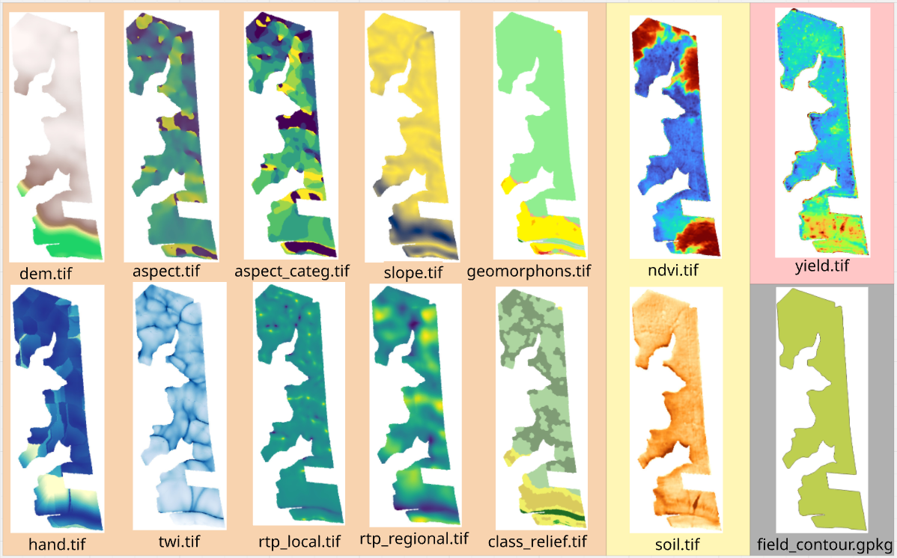

*Figure 2: Input raster layers for a single field. **DEM-derived terrain maps**
(orange background): DEM — absolute elevation; aspect — terrain orientation;
aspect_categ — categorical aspect direction; slope — terrain gradient;
geomorphons — landform morphological classification; HAND — height above
nearest drainage; TWI — topographic wetness index; rtp_local and rtp_regional —
relative topographic position at two scales; class_relief — relief complexity
classification. **Satellite-derived layers** (orange background): NDVI —
pre-season vegetation index computed from Sentinel-2 multispectral bands;
soil — soil property index derived from Sentinel-2 True Color Composite
(RGB, bands B04/B03/B02). **Yield and field boundary** (pink/grey background):
yield.tif — combine harvester yield map (target variable and masked input
channel simultaneously); field_contour.gpkg — vector field boundary polygon
rasterized to binary mask. All rasters are aligned to 5 m resolution in
UTM coordinate system (EPSG:32636).*

#### Continuous features (8 channels, Z-score normalized)

| Feature | Description | Channels |
|---|---|---|
| DEM | Absolute elevation (m) — captures large-scale topographic position | 1 |
| Slope | Local terrain gradient (degrees) — related to water runoff and erosion | 1 |
| Aspect | Terrain orientation — encoded as sin + cos to preserve angular circularity | 2 |
| HAND | Height Above Nearest Drainage (m) — proxy for soil wetness and flooding risk | 1 |
| TWI | Topographic Wetness Index — compound index of upslope area and local slope | 1 |
| RTP local | Relative Topographic Position at local scale — captures micro-relief | 1 |
| RTP regional | Relative Topographic Position at regional scale — captures landscape position | 1 |

#### Categorical features (26 channels, one-hot encoded)

| Feature | Description | Classes | Channels |
|---|---|---|---|
| Geomorphons | Landform classification: peak, ridge, shoulder, spur, slope, hollow, footslope, valley, pit, flat | 10 | 10 |
| Relief class | Local terrain complexity classification | 8 | 8 |
| Aspect category | 8-direction aspect classification (N, NE, E, SE, S, SW, W, NW) | 8 | 8 |

#### Additional scalar features (2 channels, Z-score normalized)

| Feature | Description | Channels |
|---|---|---|
| Soil index | Composite soil property map reflecting spatial distribution of texture and organic matter | 1 |
| NDVI | Normalized Difference Vegetation Index — pre-season satellite-derived vegetation index reflecting crop establishment and soil fertility | 1 |

#### Yield context channels (3 channels)

| Feature | Description | Channels |
|---|---|---|
| Masked yield | Normalized yield values set to zero inside gaps | 1 |
| Hole mask | Binary map: 1 = observed pixel, 0 = gap | 1 |
| Field mask | Binary map: 1 = inside field boundary, 0 = outside | 1 |

The yield raster is not passed to the model as-is. During training, synthetic
gaps are cut from the observed yield map to simulate GPS dropout patterns:
rectangular strips are rotated to the detected combine harvester stripe angle
and placed at random positions within the field. The masked yield channel
contains observed values outside the gaps and zeros inside. The hole mask
explicitly encodes gap locations as a separate binary channel, allowing the
model to distinguish between true zero yield and missing data. At inference
time, real NaN regions from the harvester are used directly as the hole mask
— no synthetic masking is applied.

---

### 2.3 Raster Preparation

#### 2.3.1 DEM Preprocessing — Artifact Correction

Raw Copernicus DEM GLO-30 (resampled to 5 m) contains systematic elevation
artifacts around field boundaries caused by forest canopy returns — the satellite
radar signal reflects off tree canopy rather than ground surface, producing
artificially elevated pixels at forest-field transitions.

A custom correction algorithm (`scripts/correct_dem.py`) was developed to detect
and fill these artifacts:

**1. Suspect zone detection.**
A geometric ring zone is constructed around each field boundary (80 m outward +
15 m inward buffer), intersected with an expanded forest mask (ESA WorldCover,
dilated by 15 m). Pixels inside this zone are considered potentially anomalous.

**2. Dynamic reference zone.**
Initial reference pixels are taken from open (non-forest) areas outside the
suspect zone. Suspect pixels are processed in order from closest to farthest
from the reference zone. For each suspect pixel an adaptive-radius search
(60–180 m) finds nearby reference pixels and computes their median elevation.
If the pixel elevation exceeds the local median by more than 2.5 m — it is
marked as anomalous. Otherwise it is added to the growing reference set,
allowing the reference zone to expand dynamically inward.

**3. Artifact filling.**
Anomalous pixels are filled using inverse-distance weighted mean of nearby
donor pixels — field pixels outside the suspect zone with valid elevation values.
The search radius expands adaptively until at least 3 donor points are found.

This approach is entirely pixel-level — no external ground truth elevation
is required. The algorithm uses only spatial context from the raster itself,
combining morphological operations (binary dilation), spatial indexing
(cKDTree nearest-neighbour search), and distance transforms — all standard
computer vision and computational geometry methods applied to geospatial rasters.

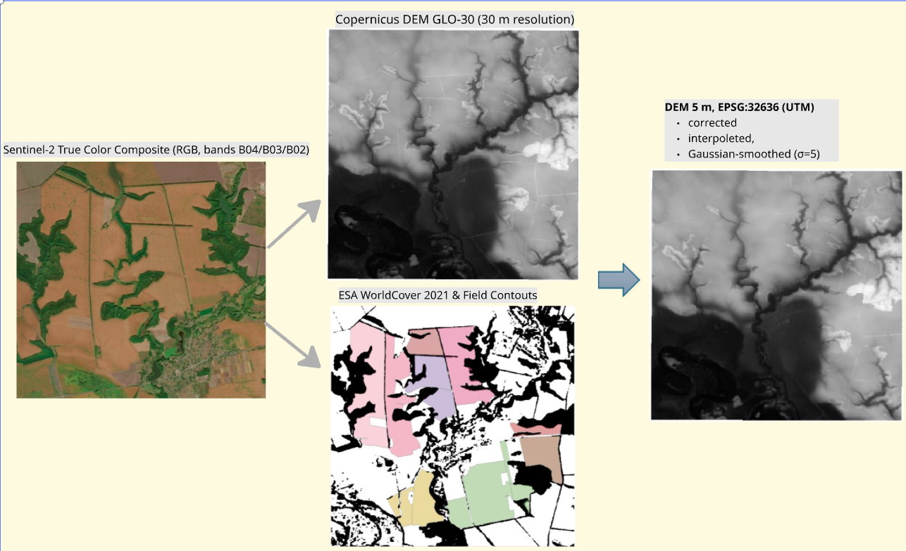

*Figure 3: DEM preprocessing pipeline. Left: Sentinel-2 True Color Composite
(RGB, bands B04/B03/B02) and ESA WorldCover 2021 land cover map with field
boundaries used to identify forest-field transition zones. Center: raw
Copernicus DEM GLO-30 (30 m resolution) showing elevation artifacts caused
by forest canopy radar returns. Right: corrected, interpolated and
Gaussian-smoothed DEM resampled to 5 m resolution (EPSG:32636, UTM),
ready for derivative computation.*

---

#### 2.3.2 Terrain Derivative Maps

All geomorphological, topographic and hydrological raster layers are derived
from the corrected and resampled DEM using standard GIS and terrain analysis
methods:

- **Slope** and **Aspect** — computed from the DEM surface using gradient
  estimation in a 3×3 pixel neighbourhood
- **HAND** (Height Above Nearest Drainage) — computed by identifying drainage
  network from flow accumulation and measuring vertical distance from each
  pixel to the nearest channel
- **TWI** (Topographic Wetness Index) — computed as ln(upslope contributing
  area / tan(slope))
- **RTP local / RTP regional** — computed as deviation of local elevation
  from a smoothed surface at two spatial scales
- **Geomorphons** — landform classification based on pattern of elevation
  comparisons in multiple directions around each pixel
- **Relief class** — classification of local terrain complexity based on
  elevation range within a moving window
- **Aspect category** — reclassification of continuous aspect angle into
  8 cardinal directions

The full terrain derivative pipeline is implemented as a separate preprocessing
workflow outside the scope of this report. The resulting rasters are provided
as ready-to-use inputs to the inpainting model.

---

#### 2.3.3 SOIL Index

*Script: `scripts/get_soils_sentinelhub.py`*

The soil raster is derived from **Sentinel-2 L2A** multispectral satellite imagery
(ESA Copernicus programme, passive optical sensor, 10 m native resolution),
acquired during the bare soil period (March–April) before crop emergence.

**Formula:**

$$SOIL = \frac{mean(B02, B03, B04)}{max(mean(B02, B03, B04))}$$

The three visible RGB bands are used:
- **B02** — Blue (490 nm)
- **B03** — Green (560 nm)
- **B04** — Red (665 nm)

For each cloud-free date, the mean of the three bands is computed per pixel
and normalized by the scene maximum. The final SOIL layer is averaged across
all selected cloud-free dates within the acquisition period.

---

#### 2.3.4 NDVI

*Script: `scripts/get_ndvi_sentinelhub.py`*

NDVI (Normalized Difference Vegetation Index) is a widely used remote sensing
index that quantifies vegetation density and health. It exploits the contrast
between strong chlorophyll absorption in the red band and high reflectance in
the near-infrared band — healthy vegetation absorbs red light for photosynthesis
and strongly reflects NIR, producing high NDVI values. Values range from -1 to 1,
where higher values indicate denser and healthier vegetation cover.

The index is computed from **Sentinel-2 L2A** multispectral imagery using two bands:
- **B04** — Red (665 nm)
- **B08** — Near-Infrared / NIR (842 nm)

$$NDVI = \frac{B08 - B04}{B08 + B04}$$

Cloud-free dates are identified using the Scene Classification Layer (SCL).
For **corn**, the mean NDVI raster is derived from cloud-free observations in
**August–September** (peak vegetation period), filtered to the active vegetation
range of **0.5–0.8**. The final raster is averaged across all qualifying dates
within this period.

---

#### 2.3.5 Raster Warping and Alignment 

*Script: `scripts/raster_warp.py`*

To prepare input data for the neural network, all rasters must share identical
spatial resolution, array dimensions, and coordinate reference system.
Each raster (Yield, Soil, NDVI) is aligned to the reference DEM grid
(5 m/pixel, metric CRS) through the following pipeline:

1. **Field clipping** — each raster is clipped to the field boundary polygon,
   masking out-of-field pixels with NaN
2. **Reprojection** — rasters are reprojected from their native CRS to the
   metric CRS of the DEM using bilinear resampling
3. **NaN filling** — missing pixels inside the field boundary are filled via
   spatial interpolation (linear method, with nearest-neighbor fallback)
4. **Gaussian smoothing** — light smoothing (σ=1.0) is applied inside the
   field mask to reduce sensor noise after resampling

After processing, all rasters have identical shape, pixel size (5 m), 
and spatial extent, enabling pixel-to-pixel correspondence 
across NDVI, Soil, Yield, and DEM layers.

#### 2.3.6 Aspect Reclassification

*Script: `scripts/reclassify_aspect.py`*

The continuous aspect raster (0–360°) is reclassified into 8 discrete cardinal
direction categories to provide the model with a compact directional encoding
of slope orientation:

| Code | Direction |
|------|-----------|
| 0    | N         |
| 1    | NE        |
| 2    | E         |
| 3    | SE        |
| 4    | S         |
| 5    | SW        |
| 6    | W         |
| 7    | NW        |

The reclassified raster is subsequently one-hot encoded into 8 binary channels
before being passed to the model (see Section 2.1).

---

### 2.4 Target Variable

The target variable is the **yield value in t/ha** at gap pixels. During
training, synthetic holes are cut from the observed yield map — the original
yield values at hole locations are known and serve as ground truth for
computing the loss. The model learns to predict yield exclusively inside
the masked regions, and all evaluation metrics are computed only on hole pixels.

All yield values are Z-score normalized using training-set statistics
(mean and standard deviation) before being passed to the model. Predictions
are denormalized back to real units (t/ha) for evaluation and visualization.

At inference time, real NaN gaps from the combine harvester are used
directly as the hole mask — the ground truth is unknown and the model
prediction fills these regions.

#### 2.4.1 Hole Simulation: Combine Harvester Stripe Detection

Real yield map gaps caused by GPS signal loss or sensor malfunction tend to follow
the direction of combine harvester passes — narrow elongated strips aligned with the
field traversal angle. To simulate realistic holes during training, we detect this
dominant angle from the yield raster itself and orient synthetic holes accordingly.

**Algorithm**

The detection pipeline consists of three stages:

**Stage 1 — FFT High-Frequency Residual.**
The yield raster is normalized within the field boundary (eroded by 10px to avoid
edge effects). A Gaussian low-pass filter (σ = 15px) approximates the large-scale
spatial trend — terrain relief, soil gradients, drainage channels. Subtracting this
trend from the normalized raster yields a high-frequency residual that isolates
the periodic stripe pattern of combine passes from other spatial factors.

**Stage 2 — Canny Edge Detection.**
The residual is normalized to uint8 and passed through a Canny edge detector
(thresholds 30/80). This produces a binary edge map where the boundaries between
high-yield and low-yield stripes are explicitly marked as edge pixels.

**Stage 3 — Gradient Direction Voting.**
For each edge pixel, the local gradient direction is computed via Sobel operators.
Since gradients are perpendicular to edges, the stripe angle equals the gradient
angle rotated by 90°. A smoothed histogram of these angles across all edge pixels
serves as a voting mechanism — the dominant bin corresponds to the combine
harvester traversal direction.

The resulting angles are pre-computed once per field and saved to
`data/stripe_angles.json`. During training, `YieldDataset` reads this file and
rotates synthetic hole masks to match the detected stripe direction.

**Results**

The algorithm was applied to all 30 fields in the dataset. Representative results
are shown below — each panel displays the original yield map with detected stripe
direction overlaid (left), the FFT high-frequency residual (center), and the
gradient angle voting histogram (right).

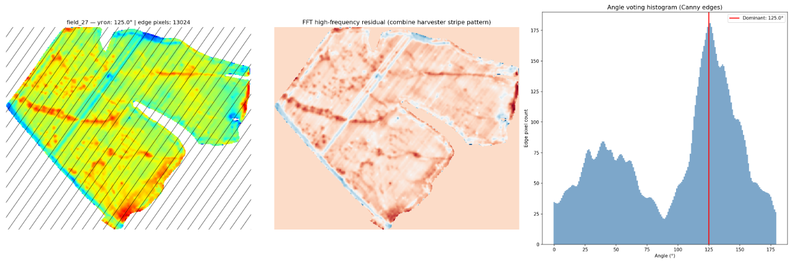
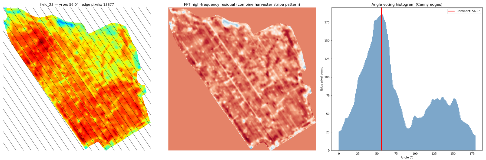

*Figure 4: Combine harvester stripe detection results for field_27 (top) and field_23 (bottom). Each panel shows the original yield map with detected stripe direction overlaid (left), the FFT high-frequency residual isolating the periodic stripe pattern (center), and the gradient angle voting histogram with dominant direction peak (right).*

| Field | Detected angle (°) | Edge pixels |
|---|---|---|
| field_01 | 116.0 | 6657 |
| field_02 | 30.0 | 2689 |
| field_03 | 46.0 | 9819 |
| field_04 | 16.0 | 4301 |
| field_05 | 149.0 | 9878 |
| field_06 | 144.0 | 4225 |
| field_07 | 15.0 | 5037 |
| field_08 | 37.0 | 6176 |
| field_09 | 92.0 | 11454 |
| field_10 | 83.0 | 2763 |
| field_11 | 172.0 | 9270 |
| field_12 | 31.0 | 6397 |
| field_13 | 92.0 | 4356 |
| field_14 | 27.0 | 16033 |
| field_15 | 38.0 | 19063 |
| field_16 | 64.0 | 10296 |
| field_17 | 81.0 | 15322 |
| field_18 | 100.0 | 7067 |
| field_19 | 142.0 | 8002 |
| field_20 | 162.0 | 3192 |
| field_21 | 40.0 | 12324 |
| field_22 | 144.0 | 5258 |
| field_23 | 56.0 | 13877 |
| field_24 | 151.0 | 17948 |
| field_25 | 11.0 | 10283 |
| field_26 | 13.0 | 18439 |
| field_27 | 125.0 | 13024 |
| field_28 | 129.0 | 11929 |
| field_29 | 61.0 | 5321 |
| field_30 | 62.0 | 16568 |

All 30 fields were successfully processed. Detected angles span the full 0–180°
range, confirming that fields were harvested in different directions with no
dominant global orientation.

---

#### 2.4.2 Hole Simulation: Synthetic Gap Generation

Each hole is a rectangle with randomized dimensions, rotated to the detected
stripe angle of the field:

| Parameter | Value |
|---|---|
| Holes per patch | 1-3 (random) |
| Width (short side) | 5–15 px |
| Length (long side) | 20–50 px |
| Rotation angle | Detected stripe angle per field |
| Overlap | Not allowed (each hole placed in free area) |
| Min valid fraction in placement area | 30% |
| Max attempts per hole | 50 |

The length is always at least twice the width to ensure elongated strip-like
shapes. Holes are placed by random center point sampling — if a candidate
position overlaps an existing hole or falls in an invalid area, a new position
is sampled (up to 50 attempts).

**Training** uses random holes (new pattern each epoch, seed=None) for
data augmentation. **Validation** uses deterministic holes (fixed seed)
for reproducible evaluation. At test time, the number of holes per field
is controlled via `--max_holes` argument and scaled proportionally to
field area to ensure consistent evaluation coverage across fields of
different sizes.

Note: augmentation techniques such as flips and rotations were **not applied**,
as all spatial predictors (aspect, slope, geomorphons, TWI) encode physically
meaningful directional information that would be corrupted by geometric
transformations.

---

### 2.5 Data Split

Fields are split at the **field level** (not patch level) to prevent data leakage:

| Split | Fields | Patches |
|---|---|---|
| Train | 20 (67%) | 360 |
| Validation | 6 (20%) | 72 |
| Test | 4 (13%) | full field inference |
| Total | 30 | — |

The training set contains 360 patches across 20 fields.

---

## 3. Experiments

Three model configurations are compared to evaluate the effect of architecture complexity and hyperparameter optimization on inpainting quality.

| # | Model | Description |
|---|---|---|
| 1 | **Baseline** | Shallow UNet, depth 3, base\_channels=16, ~488K parameters |
| 2 | **Deep UNet** | Deep UNet, depth 4, base\_channels=32, ~7.8M parameters |
| 3 | **Deep UNet + Optuna** | Deep UNet, depth 4, base\_channels=16, ~1.9M parameters, hyperparameters optimized via Optuna TPE (50 trials) |

All models share the same loss function, training procedure, data split, and evaluation protocol.

**Loss Function**

All three models are trained with the same composite loss function:

$$\mathcal{L} = \mathcal{L}_{missing} + w_{known} \cdot \mathcal{L}_{known} + w_{smooth} \cdot \mathcal{L}_{smooth}$$

where:
- $\mathcal{L}_{missing} = 0.5 \cdot \text{MSE}_{holes} + 0.5 \cdot \text{MAE}_{holes}$ — main loss computed exclusively on synthetic hole pixels
- $\mathcal{L}_{known} = \text{MAE}_{known}$ — regularization term on observed pixels, prevents the model from ignoring known yield values
- $\mathcal{L}_{smooth}$ — total variation penalty on predicted hole pixels, encourages spatial smoothness of reconstructed values

Default weights: $w_{known} = 0.1$, $w_{smooth} = 0.02$. For the Optuna-tuned
model these weights are optimized during hyperparameter search.

**Common Training Setup**

All three models share the following training protocol:

*Optimizer:* AdamW with weight decay

*Data split:* 20 train / 6 validation / 4 test fields (fixed seed=42)

*Patch extraction:* sliding window with patch size 128×128 px, stride 64 px

*Hole simulation:* rotated rectangular strips aligned to detected combine
harvester stripe angle per field. During training, holes are generated
randomly per patch with a new pattern at each epoch. During testing, holes
are generated deterministically on full fields with count proportional
to field area.

*Normalization:* all continuous input channels are Z-score normalized
using training set statistics (mean and std). Model output is in normalized
space and is denormalized back to t/ha for evaluation and visualization.
Categorical channels (geomorphons, relief class, aspect category) are
one-hot encoded and not normalized. Binary channels (hole mask, field mask)
are passed as-is (0/1).

*Hardware:* NVIDIA GeForce RTX 3090 (24 GB VRAM), CUDA 13.0

*Evaluation metrics:* MAE, RMSE, Bias, MAPE, R² computed exclusively
on hole pixels in real units (t/ha)

*Experiment tracking:* all training metrics (loss, MAE, RMSE, Bias, MAPE, R²),
validation patch reconstructions, and error maps are logged to TensorBoard
and MLflow for each experiment. Model checkpoints are saved at best validation
loss.

---

### 3.1 Baseline UNet

#### Architecture

The baseline model is a shallow UNet with 3 encoder levels, a bottleneck, and 3 decoder levels with skip connections. GroupNorm is used instead of BatchNorm for stability with small batch sizes. The total number of trainable parameters is **487,921** (~0.49M).

| Component | Channels |
|---|---|
| Input | 39 |
| Encoder 1 | 16 |
| Encoder 2 | 32 |
| Encoder 3 | 64 |
| Bottleneck | 128 |
| Decoder 3 | 64 |
| Decoder 2 | 32 |
| Decoder 1 | 16 |
| Output | 1 |

The model receives a 39-channel input stack as described in Section 2.1.

#### Training Configuration

| Parameter | Value |
|---|---|
| Epochs | 50 |
| Batch size | 8 |
| Patch size | 128 × 128 px |
| Stride | 64 px |
| Learning rate | 0.001 |
| Weight decay | 0.0001 |
| Optimizer | AdamW |

#### Training Results

The baseline model was trained for 50 epochs with patch size 128×128, batch size 8, and AdamW optimizer (lr=1e-3). Synthetic holes were generated at the detected combine harvester stripe angle for each field.

| Metric | Value |
|---|---|
| train_loss | 0.0892 |
| val_loss | 0.1264 |
| val_MAE | 0.398 t/ha |
| val_RMSE | 0.540 t/ha |
| val_Bias | +0.140 t/ha |
| val_MAPE | 3.94% |
| val_R² | 0.866 |

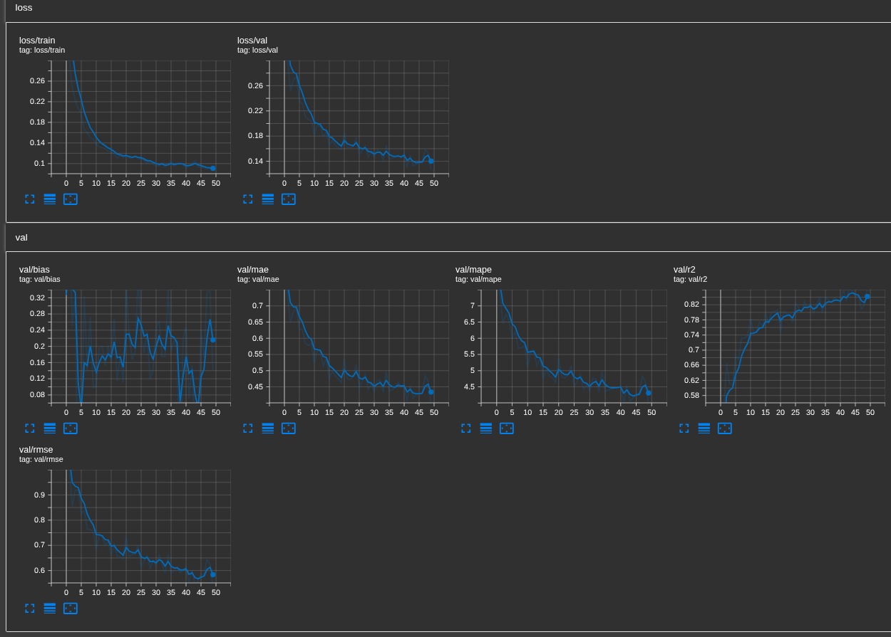

*Figure 5: TensorBoard scalars: baseline train + validation (loss and metrics)*

The training and validation losses converge closely (0.089 vs 0.126), indicating no significant overfitting. The validation R² of 0.866 demonstrates strong spatial reconstruction quality. The val/mae curve shows steady improvement across all 50 epochs with no plateau, suggesting the model could benefit from additional training.

#### Qualitative Results on Validation Patch

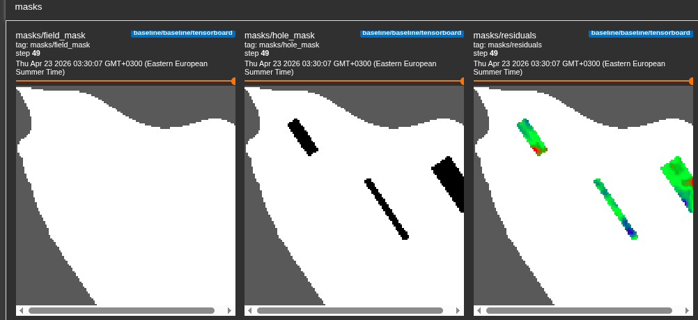

*Figure 6: TensorBoard: baseline validation mask and error*

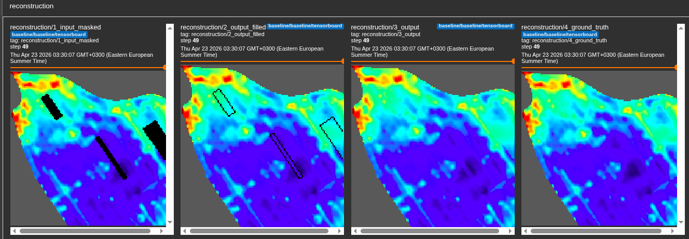

*Figure 7: TensorBoard: baseline validation patch reconstruction*

#### Test Results

The model was evaluated on 4 held-out test fields with a variable number of synthetic holes per field proportional to field area, generated at the detected stripe angle.

**Per-field metrics:**

| Field | MAE (t/ha) | RMSE (t/ha) | Bias (t/ha) | MAPE (%) | R² |
|---|---|---|---|---|---|
| field_11 | 0.330 | 0.457 | +0.009 | 3.60 | 0.788 |
| field_15 | 0.258 | 0.329 | -0.180 | 2.37 | 0.351 |
| field_20 | 0.359 | 0.480 | -0.173 | 4.28 | 0.570 |
| field_27 | 0.375 | 0.486 | +0.206 | 4.11 | 0.689 |

**Global test metrics:**

| Metric | Value |
|---|---|
| test_MAE | 0.339 t/ha |
| test_RMSE | 0.456 t/ha |
| test_Bias | +0.018 t/ha |
| test_MAPE | 3.70% |
| test_R² | 0.824 |

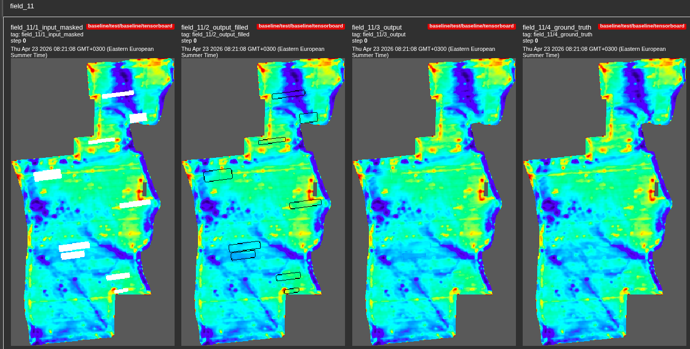

*Figure 8: TensorBoard: baseline test field_11 reconstruction*

<table>
<tr>
<td>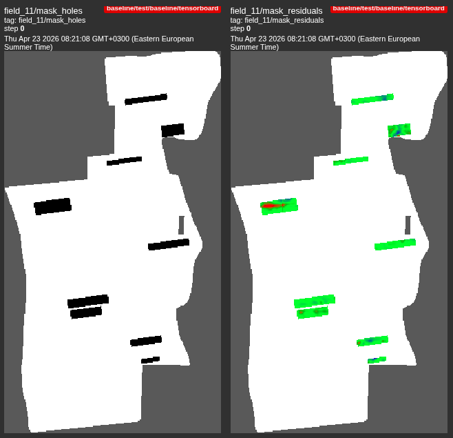</td>
<td>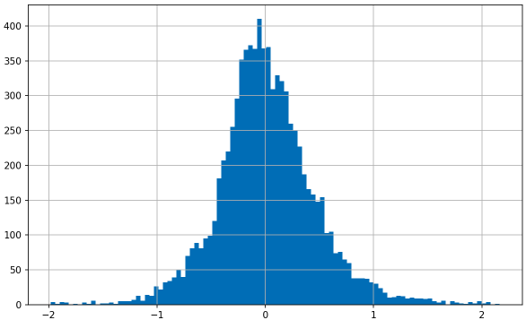
<em style="display:block; text-align:center;">Figure 10: Prediction error distribution across test fields (t/ha).</em>
</td>
</tr>
</table>

*Figure 9: TensorBoard: baseline test field_11 prediction residuals*

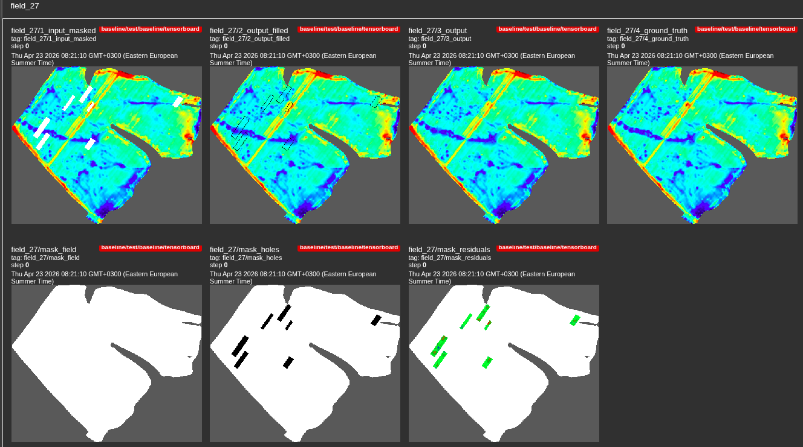

*Figure 11: TensorBoard: baseline test field_27 reconstruction*

The error distribution histogram shows a near-symmetric bell shape centered
near zero, confirming the absence of strong systematic bias. The Baseline model
demonstrates solid reconstruction quality for a compact ~488K parameter
architecture — test MAE of 0.339 t/ha and MAPE of 3.70% confirm low absolute
and relative error in real yield units, while the near-zero bias (+0.018 t/ha)
indicates excellent calibration and the test R² of 0.824 confirms that the
model explains 82% of yield variance on held-out fields. Reconstruction quality
varies across fields, reflecting differences in spatial yield pattern complexity. 
The 50-epoch training curve shows no plateau, suggesting the model could
benefit from additional training.

---

### 3.2 Deep UNet

#### Architecture

The Deep UNet extends the Baseline with an additional encoder-decoder level
and doubled base channels (32 vs 16), enabling richer feature representations.
Total trainable parameters: **7,773,409** (~7.8M).

| Component | Channels |
|---|---|
| Input | 39 |
| Encoder 1 | 32 |
| Encoder 2 | 64 |
| Encoder 3 | 128 |
| Encoder 4 | 256 |
| Bottleneck | 512 |
| Decoder 4 | 256 |
| Decoder 3 | 128 |
| Decoder 2 | 64 |
| Decoder 1 | 32 |
| Output | 1 |

The model receives a 39-channel input stack as described in Section 2.1.

#### Training Configuration

| Parameter | Value |
|---|---|
| Epochs | 80 |
| Batch size | 8 |
| Patch size | 128 × 128 px |
| Stride | 64 px |
| Learning rate | 0.001 |
| Weight decay | 0.0001 |
| Optimizer | AdamW |

#### Training Results

The Deep UNet was trained for 80 epochs with patch size 128×128, batch size 8,
and AdamW optimizer (lr=1e-3). The increased model depth (4 encoder-decoder
levels + bottleneck) and base channels (32 vs 16) allow the model to capture
more complex spatial patterns in the yield maps.

| Metric | Value |
|---|---|
| train_loss | 0.0801 |
| val_loss | 0.1307 |
| val_MAE | 0.413 t/ha |
| val_RMSE | 0.550 t/ha |
| val_Bias | -0.113 t/ha |
| val_MAPE | 3.93% |
| val_R² | 0.861 |

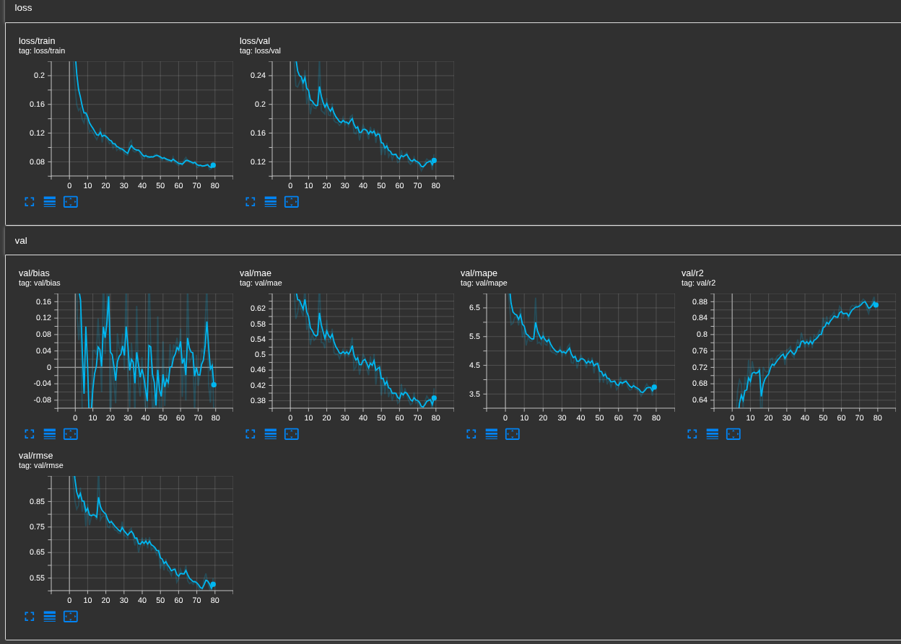

*Figure 12: TensorBoard scalars: Deep UNet train + validation (loss and metrics)*

The Deep UNet achieves lower train_loss (0.080 vs 0.089) compared to the
Baseline, confirming that the deeper architecture captures more complex spatial
patterns. The validation loss curve shows higher variance compared to the
Baseline — characteristic of deeper models during early training phases.
Both losses continue to decrease at epoch 80 without plateau.

#### Qualitative Results on Validation Patch

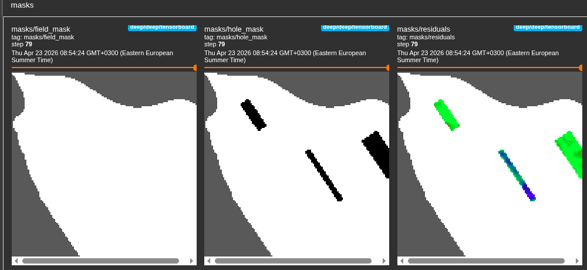

*Figure 13: TensorBoard: Deep UNet validation mask and error*

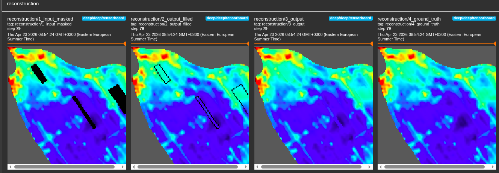

*Figure 14: TensorBoard: Deep UNet validation patch reconstruction*

#### Test Results

The model was evaluated on 4 held-out test fields with a variable number of
synthetic holes per field proportional to field area, generated at the detected
stripe angle.

**Per-field metrics:**

| Field | MAE (t/ha) | RMSE (t/ha) | Bias (t/ha) | MAPE (%) | R² |
|---|---|---|---|---|---|
| field_11 | 0.331 | 0.476 | +0.144 | 3.69 | 0.770 |
| field_15 | 0.185 | 0.246 | -0.046 | 1.71 | 0.636 |
| field_20 | 0.249 | 0.326 | -0.023 | 3.02 | 0.801 |
| field_27 | 0.316 | 0.423 | +0.170 | 3.49 | 0.765 |

**Global test metrics:**

| Metric | Value |
|---|---|
| test_MAE | 0.297 t/ha |
| test_RMSE | 0.418 t/ha |
| test_Bias | +0.104 t/ha |
| test_MAPE | 3.29% |
| test_R² | 0.852 |

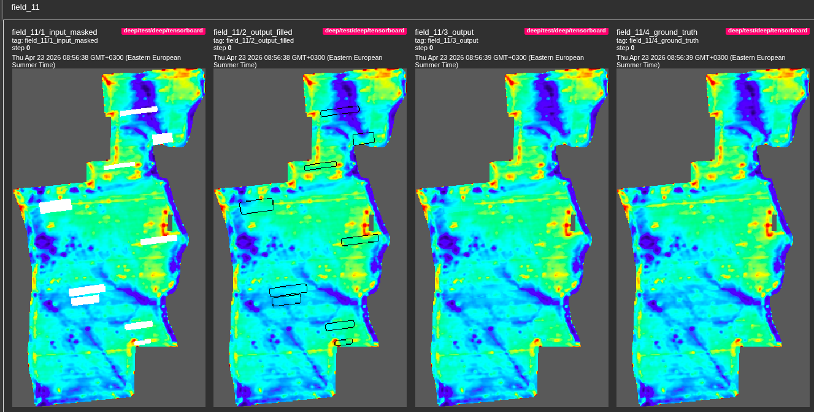

*Figure 15: TensorBoard: Deep UNet test field_11 reconstruction*

<table>
<tr>
<td>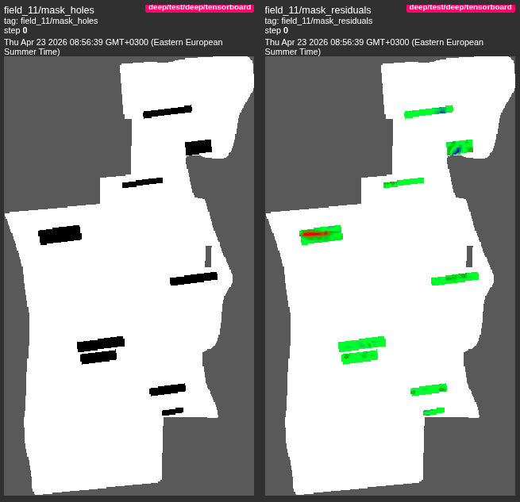</td>
<td>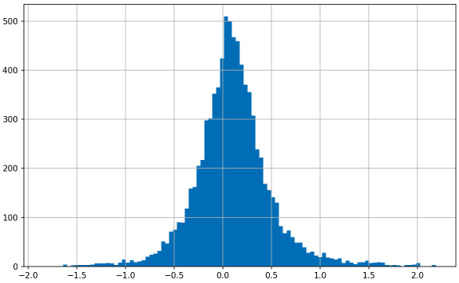
<em style="display:block; text-align:center;">Figure 17: Deep UNet — prediction error distribution across test fields (t/ha).</em>
</td>
</tr>
</table>

*Figure 16: TensorBoard: Deep UNet field_11  prediction residuals*

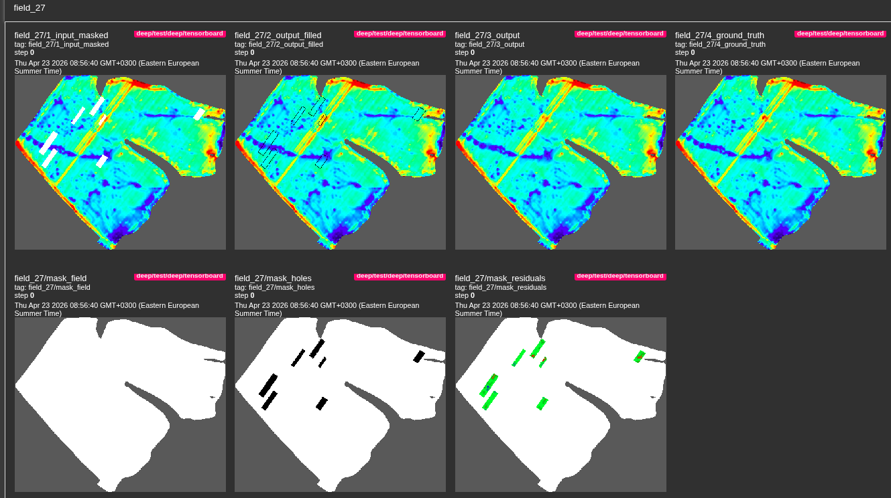

*Figure 18: TensorBoard: Deep UNet test field_27 reconstruction*

The Deep UNet improves over the Baseline across all global test metrics.
The error histogram shows a symmetric near-Gaussian distribution centered
near zero. Test MAE of 0.297 t/ha and MAPE of 3.29% confirm low absolute
and relative error in real yield units. The test R² of 0.852 confirms that
the model explains 85% of yield variance on held-out fields. The test bias
of +0.104 t/ha indicates mild systematic overestimation — the only metric
where the Deep UNet underperforms relative to Baseline and Optuna models.
Reconstruction quality varies across fields, reflecting differences in
spatial yield pattern complexity.

---

### 3.3 Deep UNet + Optuna

#### Architecture

Same architecture as Deep UNet but with `base_channels=16` selected by Optuna
instead of 32, resulting in a more compact model. Total trainable parameters:
**1,947,761** (~1.9M).

| Component | Channels |
|---|---|
| Input | 39 |
| Encoder 1 | 16 |
| Encoder 2 | 32 |
| Encoder 3 | 64 |
| Encoder 4 | 128 |
| Bottleneck | 256 |
| Decoder 4 | 128 |
| Decoder 3 | 64 |
| Decoder 2 | 32 |
| Decoder 1 | 16 |
| Output | 1 |

The model receives a 39-channel input stack as described in Section 2.1.

#### Hyperparameter Search

Bayesian hyperparameter optimization was performed using Optuna TPE sampler
over 50 trials with MedianPruner. Each trial was trained for 15 epochs and
evaluated on validation loss.

| Parameter | Search Space | Best Value |
|---|---|---|
| lr | [0.0001, 0.001] log | 0.000328 |
| smooth_weight | [0.05, 0.15] | 0.0518 |
| known_weight | [0.0, 0.01] | 0.00222 |
| weight_decay | [1e-6, 1e-4] log | 6.34e-6 |

#### Training Configuration

| Parameter | Value |
|---|---|
| Epochs | 100 |
| Batch size | 4 |
| Patch size | 128 × 128 px |
| Stride | 64 px |
| Learning rate | 0.000328 |
| Weight decay | 6.34e-6 |
| Optimizer | AdamW |

#### Regularization

The Optuna search identified a spatial smoothness weight (`smooth_weight=0.052`)
higher than the manually set value of 0.02 used in Baseline and Deep UNet.
This acts as a spatial regularizer penalizing sharp discontinuities in predicted
yield maps. Combined with near-zero `known_weight=0.00222` — focusing training
almost entirely on hole reconstruction — the model is well regularized despite
its compact size.

#### Training Results

| Metric | Value |
|---|---|
| train_loss | 0.0756 |
| val_loss | 0.0916 |
| val_MAE | 0.319 t/ha |
| val_RMSE | 0.450 t/ha |
| val_Bias | +0.120 t/ha |
| val_MAPE | 3.15% |
| val_R² | 0.906 |

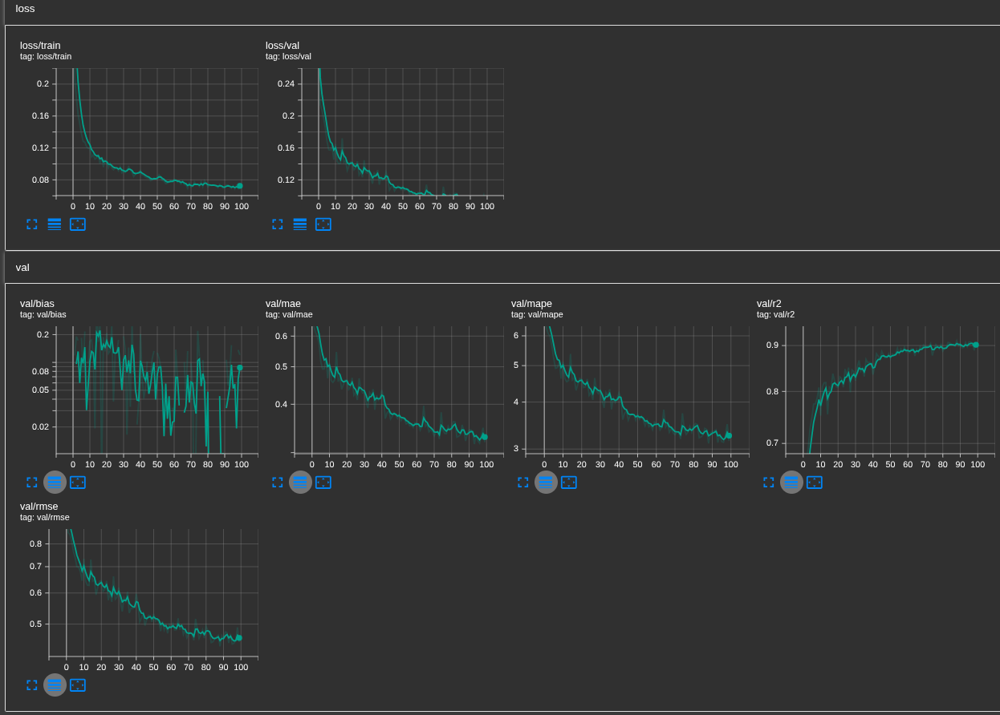

*Figure 19: TensorBoard scalars: Deep UNet + Optuna train + validation (loss and metrics)*

The Optuna-tuned model achieves the best val_loss (0.0916) and val_R² (0.906)
across all three models. The val_loss curve shows steady improvement across
all 100 epochs without plateau.

#### Qualitative Results on Validation Patch

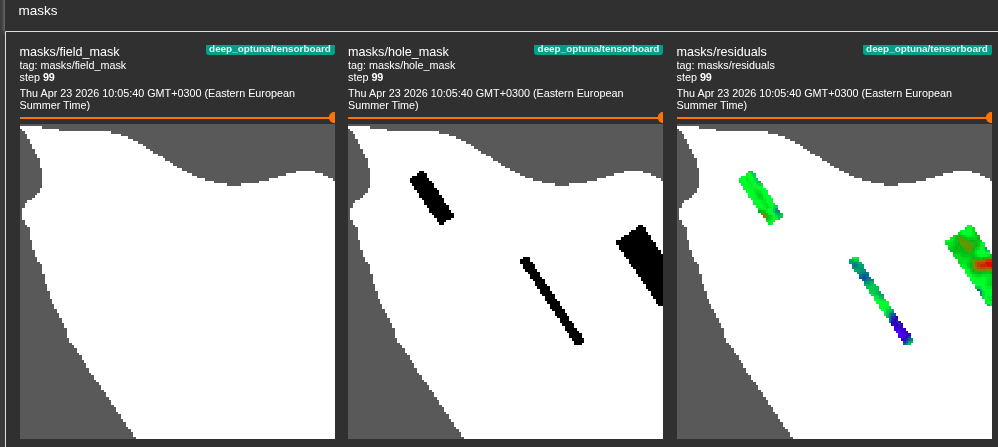

*Figure 20: TensorBoard: Deep UNet + Optuna validation mask and error*

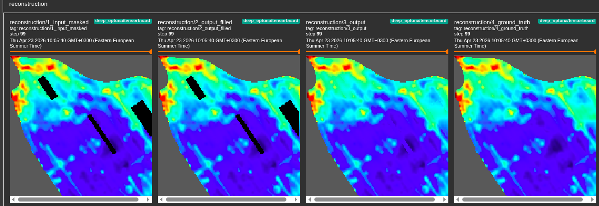

*Figure 21: TensorBoard: Deep UNet + Optuna validation patch reconstruction*

#### Test Results

The model was evaluated on 4 held-out test fields with a variable number of
synthetic holes per field proportional to field area, generated at the detected
stripe angle.

**Per-field metrics:**

| Field | MAE (t/ha) | RMSE (t/ha) | Bias (t/ha) | MAPE (%) | R² |
|---|---|---|---|---|---|
| field_11 | 0.324 | 0.443 | +0.016 | 3.53 | 0.801 |
| field_15 | 0.260 | 0.328 | +0.140 | 2.41 | 0.356 |
| field_20 | 0.307 | 0.392 | -0.220 | 3.68 | 0.713 |
| field_27 | 0.280 | 0.374 | +0.093 | 3.06 | 0.816 |

**Global test metrics:**

| Metric | Value |
|---|---|
| test_MAE | 0.301 t/ha |
| test_RMSE | 0.403 t/ha |
| test_Bias | +0.019 t/ha |
| test_MAPE | 3.28% |
| test_R² | 0.863 |

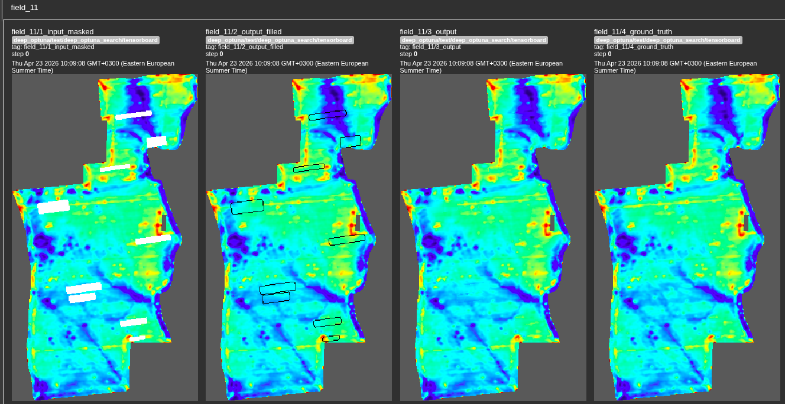

*Figure 22: TensorBoard: Deep UNet + Optuna test field_11 reconstruction*

<table>
<tr>
<td>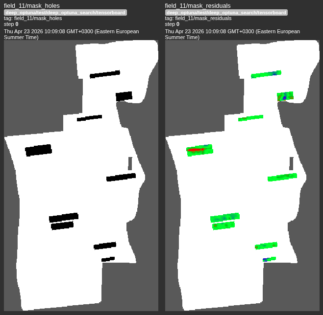</td>
<td>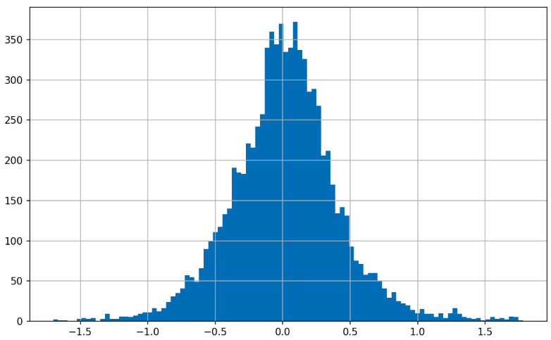
<em style="display:block; text-align:center;">Figure 24: Deep UNet + Optuna — prediction error distribution across test fields (t/ha).</em>
</td>
</tr>
</table>

*Figure 23: TensorBoard: Deep UNet + Optuna field_11 prediction residuals*

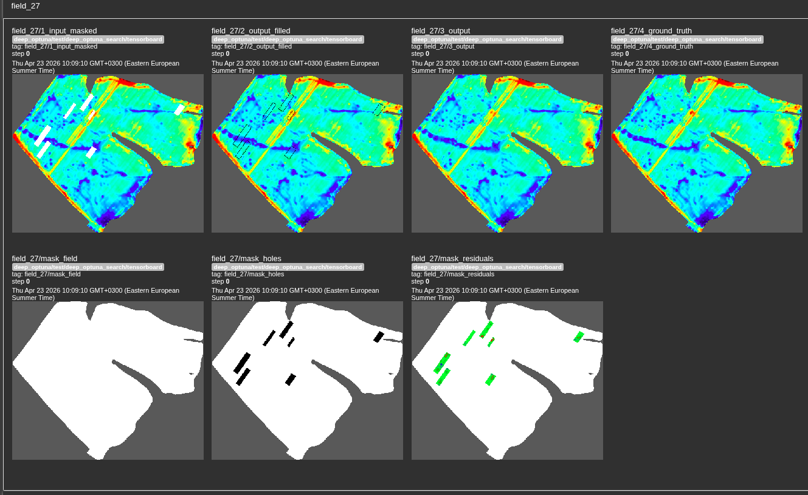

*Figure 25: TensorBoard: Deep UNet + Optuna test field_27 reconstruction*

The Optuna-tuned model achieves the best RMSE, Bias and R² across all three
models. The error histogram shows a symmetric near-Gaussian distribution centered
near zero. Test MAE of 0.301 t/ha and MAPE of 3.28% confirm low absolute and
relative error in real yield units, while the near-zero bias (+0.019 t/ha)
indicates excellent calibration and the test R² of 0.863 confirms that the
model explains 86% of yield variance on held-out fields. Reconstruction quality
varies across fields, reflecting differences in spatial yield pattern complexity.

---

## 4. Results Summary and Comparison

| Metric | Baseline UNet | Deep UNet | Deep UNet + Optuna |
|---|---|---|---|
| **Parameters** | ~488K | ~7.8M | ~1.9M |
| **val_MAE (t/ha)** | 0.398 | 0.413 | 0.319 |
| **val_RMSE (t/ha)** | 0.540 | 0.550 | 0.450 |
| **val_Bias (t/ha)** | +0.140 | -0.113 | +0.120 |
| **val_MAPE (%)** | 3.94 | 3.93 | 3.15 |
| **val_R²** | 0.866 | 0.861 | 0.906 |
| **test_MAE (t/ha)** | 0.339 | **0.297** | 0.301 |
| **test_RMSE (t/ha)** | 0.456 | 0.418 | **0.403** |
| **test_Bias (t/ha)** | +0.018 | +0.104 | **+0.019** |
| **test_MAPE (%)** | 3.70 | **3.29** | 3.28 |
| **test_R²** | 0.824 | 0.852 | **0.863** |

### Conclusions

**1. All three models demonstrate strong reconstruction quality.** The Baseline UNet with only ~488K parameters achieves test R²=0.824 and test MAE=0.339 t/ha, confirming that the spatial predictor channels (DEM, NDVI, slope, geomorphons, etc.) provide sufficient information for accurate yield reconstruction inside combine harvester gaps.

**2. Model depth improves reconstruction quality.** The Deep UNet with ~7.8M parameters improves test_MAE from 0.339 to 0.297 t/ha and test_R² from 0.824 to 0.852 over the Baseline. The deeper architecture captures more complex spatial patterns but at the cost of 16× more parameters and elevated test bias (+0.104 t/ha).

**3. Hyperparameter optimization delivers the best overall performance.** The Optuna-tuned model achieves the best results across the majority of test metrics despite using only ~1.9M parameters. Specifically, it achieves the lowest RMSE (0.403 t/ha), lowest bias (+0.019 t/ha), best R² (0.863), and competitive MAPE (3.28%). The Deep UNet retains a slight edge on MAE (0.297 vs 0.301 t/ha), but the Optuna model outperforms on all other metrics.

**4. Optimal hyperparameters are non-intuitive.** Optuna selected `base_channels=16` (smaller than the manually set 32), `known_weight=0.00222` (near-zero weight on observed pixels), and `smooth_weight=0.052` (higher spatial regularization than default 0.02). These parameters would not have been found by manual tuning, demonstrating the value of automated search.

**5. Bias calibration improves with tuning.** The Baseline and Optuna models both achieve near-zero test bias (+0.018 and +0.019 t/ha respectively), while the Deep UNet shows systematic overestimation (+0.104 t/ha). This confirms that regularization found by Optuna effectively eliminates systematic error.

**6. Error distributions are symmetric and centered near zero.** All three models produce near-Gaussian error histograms without heavy tails, confirming no systematic spatial bias in reconstruction.

### Best Model

The **Deep UNet + Optuna** model is selected as the best model for production inference based on superiority across the majority of test metrics:
- Best test_RMSE: **0.403 t/ha**
- Near-zero bias: **+0.019 t/ha**
- Best test_R²: **0.863**
- Competitive test_MAE: **0.301 t/ha**
- Compact architecture: ~1.9M parameters (4× fewer than Deep UNet)

### Feature Importance Analysis — Occlusion Sensitivity

To understand the contribution of each input channel to hole reconstruction,
an occlusion sensitivity analysis was performed on the best model
(Deep UNet + Optuna). Each input channel group was zeroed out independently
and the resulting MAE increase on hole pixels across all 4 test fields was
measured. A larger MAE increase indicates a more important channel.

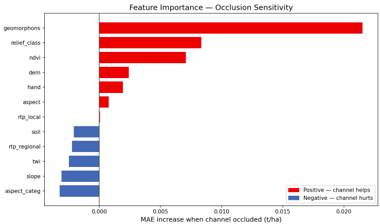

*Figure 26: Feature importance via occlusion sensitivity. Red bars indicate channels
that increase MAE when removed (helpful). Blue bars indicate channels
whose removal slightly improves MAE (potentially redundant or noisy).*

**Key Findings**

*Geomorphons* is by far the most important predictor — removing it increases
test MAE by +0.021 t/ha. This confirms that landform morphological
classification captures the dominant spatial structure of yield variability
across fields.

*Relief_class and NDVI* are the second and third most important predictors
(+0.009 and +0.007 t/ha respectively). Relief_class is a categorical landform
complexity feature — alongside geomorphons, this confirms that categorical
terrain descriptors are the primary drivers of reconstruction quality.

*DEM, HAND and aspect* contribute moderately (+0.001–0.003 t/ha each),
confirming that terrain predictors provide useful spatial context.

*Soil index, RTP regional, TWI, slope and aspect_categ* show slightly negative
importance — their removal marginally improves MAE, suggesting these channels
may introduce noise rather than useful signal in their current form.

**Observations and Implications**

The analysis reveals that **categorical terrain features** (geomorphons,
relief_class) dominate reconstruction quality, while several continuous
predictors (slope, TWI, soil, RTP regional) show near-zero or slightly
negative importance in their current form.

This does not necessarily mean these features are agronomically irrelevant —
slope and TWI are well-established drivers of crop yield variability. Rather,
the results suggest that their current continuous representation may not be
optimal for the model. Several directions for future investigation:

- **Soil reclassification** — converting continuous soil index values into
  discrete soil type categories may improve its contribution, similar to
  how geomorphons and relief_class outperform continuous terrain derivatives
- **Slope and TWI reclassification** — converting continuous values into
  categorical agronomic classes may better capture the non-linear relationship
  between terrain and yield
- **Ablation study** — systematically testing model performance with and
  without individual channel groups would provide more rigorous estimates
  of their contribution beyond occlusion sensitivity

---

## 5. Production Inference

### Gap Detection

Missing data regions are detected automatically from the yield raster itself —
no additional input is required. Any pixel within the field boundary polygon
that contains a NaN value is classified as a gap. These gaps arise from GPS
signal loss, sensor malfunction, or combine harvester overlap issues during
harvest. The field boundary polygon (GeoPackage) defines the valid spatial
extent and excludes pixels outside the field contour.

The detected gap pattern for `field_inf_01` follows clear vertical stripes
aligned with the combine harvester traversal direction — consistent with the
stripe angle detected by the FFT + Canny gradient voting algorithm during
preprocessing.

### Yield Reconstruction

Gap filling is performed by the Deep UNet + Optuna model using a sliding window
approach (patch size 128×128, stride 64). For each patch the model receives 39
input channels:

- **Masked yield map** — known yield values set to zero inside gaps
- **Hole mask** — binary map indicating gap locations
- **Field mask** — binary map of the field boundary
- **Spatial predictors** — DEM, HAND, NDVI, slope, TWI, soil index,
  RTP local/regional, aspect (sin/cos), geomorphons, relief class,
  aspect category

The spatial predictor channels provide the physical and topographic context
that guides reconstruction. Even with no yield observations inside a gap,
the model leverages elevation, terrain morphology, soil properties and
vegetation index to predict plausible yield values consistent with the
surrounding spatial patterns.

Predictions from overlapping patches are averaged at each pixel. The final
reconstructed value is inserted only into gap pixels — all observed yield
values remain unchanged.

### Results

The reconstructed yield map integrates seamlessly with the original data,
preserving spatial continuity of the yield surface. The filled GeoTIFF
is saved with the original coordinate reference system and can be directly
imported into GIS software (QGIS, ArcGIS) for agronomic analysis and
management zone delineation.

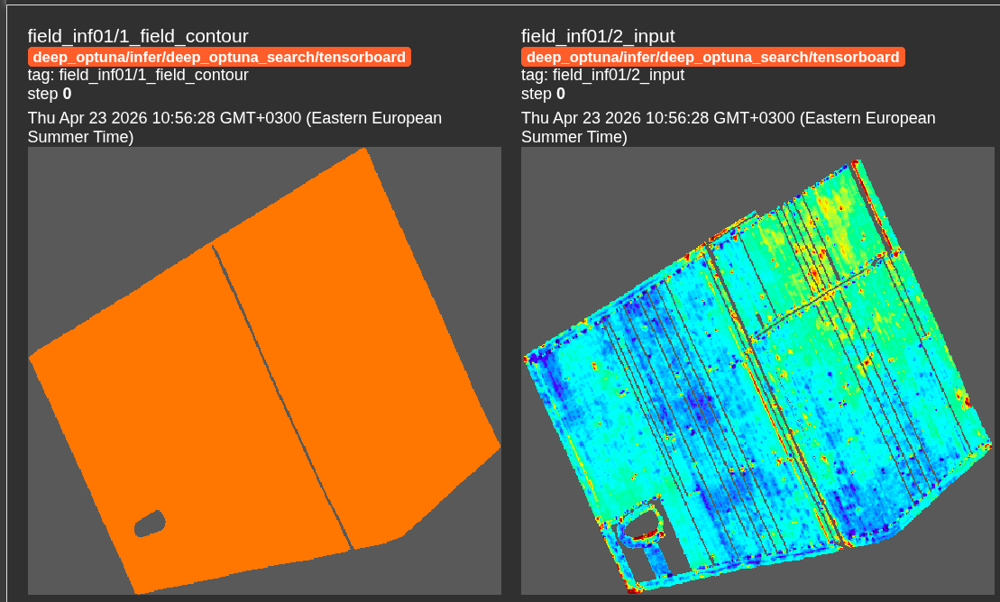
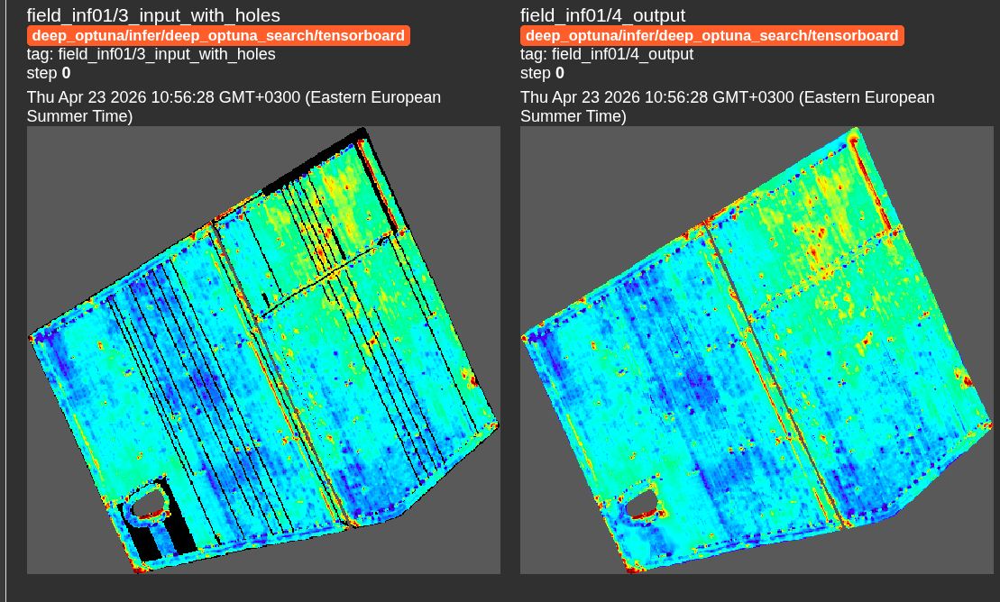

*Figure 27: Reconstructed yield map with gaps filled by Deep UNet + Optuna*

---

## 6. Future Work

### 6.1 Dataset Expansion
The current dataset comprises 30 fields from a single agricultural region. Expanding
the dataset to include fields from different regions, crop types, and years would
improve model generalization. Additional diversity in field shapes, soil types, and
yield levels would reduce overfitting to specific spatial patterns observed in
field_20 and similar outlier fields.

### 6.2 Physics-Informed Loss Constraint
A promising direction is adding a mass conservation constraint to the loss function.
The total harvested yield per field is known from combine harvester records. This
constraint can be added as a soft penalty term to the existing loss, ensuring
that gap-filling does not artificially inflate or deflate the total field yield —
a critical requirement for precision agriculture applications.

### 6.3 Realistic Gap Shape Simulation
The current hole simulation uses rotated rectangles aligned with the detected
combine harvester angle. Real GPS gaps produce more complex shapes — curved
trajectories, irregular boundaries, and clustered dropouts. Future work should
model these patterns using actual GPS logs from combine harvesters or generative
approaches such as procedural trajectory simulation.

### 6.4 Extended Feature Importance Analysis
Occlusion sensitivity analysis was performed on the best model (Section 4),
identifying geomorphons as the dominant predictor. Several directions remain open:

- *SHAP analysis* — pixel-level attribution to map spatially varying
  feature contributions across field zones
- *Feature representation* — investigating whether categorical encoding
  of continuous terrain and soil predictors better captures non-linear
  relationships with yield spatial variability
- *Ablation study* — systematic testing with different channel combinations
  to identify the optimal balance between feature informativeness and redundancy
- *New candidate predictors* — Leaf Area Index (LAI), canopy height models,
  multi-temporal NDVI profiles, and precipitation data
- *Field-level analysis* — understanding why certain fields are systematically
  harder to reconstruct across all models

### 6.5 Architectural Improvements

**Attention mechanisms.** Spatial and channel attention (CBAM, SE blocks) would
allow the model to focus on the most informative spatial regions and input channels
when reconstructing hole pixels, rather than treating all spatial locations equally.

**Partial convolutions.** Replacing standard convolutions with partial convolutions
specifically designed for inpainting would prevent the model from using hole pixels
in intermediate feature computations, potentially improving boundary sharpness.

**Transformer-based encoder.** Replacing the UNet encoder with a Swin Transformer
or similar vision transformer backbone would capture long-range spatial dependencies
beyond the local receptive field of convolutions — beneficial for reconstructing
long narrow gaps spanning the full field width.

**Multi-scale prediction.** Adding auxiliary reconstruction heads at intermediate
decoder scales with deep supervision could improve gradient flow and reconstruction
quality at different spatial resolutions.

**Uncertainty estimation.** Adding a second output head for predictive uncertainty
(e.g. via Monte Carlo Dropout or deep ensembles) would provide confidence maps
alongside reconstructed yields — valuable for downstream agronomic decisions.
